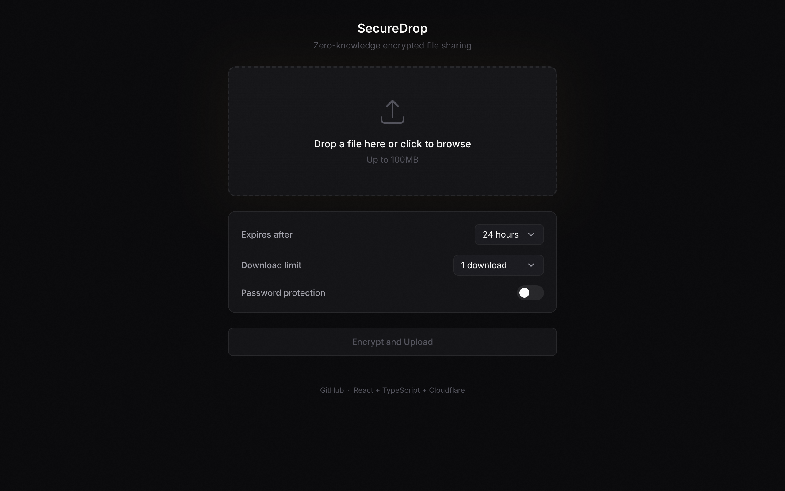
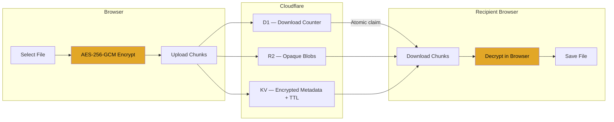

# SecureDrop

[](https://github.com/ygbull/SecureDrop/actions/workflows/ci.yml)
[](LICENSE)
[](https://www.typescriptlang.org/)

Dead simple encrypted file sharing. Files are encrypted in your browser before they ever touch the server. The decryption key lives in the URL fragment — the part after `#` that browsers never send to servers. Even if the server is fully compromised, your files stay private.

**[drop.haijieqin.com](https://drop.haijieqin.com)**



## Architecture



The decryption key lives **only** in the URL `#fragment`. Per [RFC 3986](https://datatracker.ietf.org/doc/html/rfc3986#section-3.5), fragments are never sent to the server. The server handles nothing but opaque ciphertext.

## How it works

1. You drop a file. The browser encrypts it with AES-256-GCM, splitting it into 2MB chunks.
2. The encrypted blobs get uploaded to Cloudflare R2. The server stores opaque ciphertext it can never read.
3. You get a share link. The decryption key is in the `#fragment` — it never leaves your browser, never hits the server, never gets logged.
4. The recipient opens the link. Their browser pulls the key from the fragment, downloads the encrypted blobs, decrypts everything client-side, and saves the original file.

That's it. The server is a dumb pipe for encrypted bytes.

## Design decisions

**Why the URL fragment?** The `#fragment` is the only part of a URL that browsers never send to the server ([RFC 3986 &sect;3.5](https://datatracker.ietf.org/doc/html/rfc3986#section-3.5)). So the decryption key lives there — zero-knowledge without needing a separate key exchange. On the download page, `history.replaceState()` strips it from browser history before any fetch fires.

**Chunked encryption with AAD.** Files are split into 2MB plaintext chunks, each encrypted with its own random IV. AAD binds every chunk to its index, total count, and drop ID, so you can't reorder, duplicate, or swap chunks across drops. The client checks it got all chunks before presenting the file.

**R2 individual objects, not multipart.** R2's multipart upload requires 5MB minimum parts. Our wire chunks are ~2.1MB. Rather than pad or buffer, each chunk is just its own R2 object (`drops/{id}/chunk-001`). Simpler to reason about, and each chunk is independently addressable for streaming.

**Atomic download counting.** Burn-after-reading needs a race-safe counter. A `SELECT` then `UPDATE` lets two concurrent requests both read "1 remaining" and both succeed. Instead: `UPDATE drops SET downloads = downloads + 1 WHERE id = ? AND status = 'active' RETURNING *` — one atomic statement, one winner.

**KV TTLs for auto-expiry.** Metadata goes into KV with `expirationTtl`. Cloudflare garbage-collects it automatically, no cron needed. A scheduled cron still runs to clean up R2 blobs and D1 rows for exhausted drops.

**Single-use download tokens.** When a recipient claims a drop, the handler mints a 16-char token in KV with a 5-minute TTL. The actual download endpoint checks this token, then deletes it. One token, one download — no way to reuse or share it.

**$0/month.** Everything runs on Cloudflare's free tier. The tricky part is KV's 1,000 writes/day limit — rate limiting uses a boolean-gate pattern (one write per cooldown window per IP) instead of per-request counters.

## Features

- **Zero-knowledge** — the server literally cannot decrypt your files
- **Burn after reading** — set download limits (1, 5, 20, or unlimited)
- **Auto-expiry** — files self-destruct after 1 hour, 24 hours, or 7 days
- **Password protection** — optional PBKDF2 key wrapping on top of the link
- **No accounts** — no sign-up, no login, no tracking
- **QR codes** — for easy sharing to mobile
- **$0/month** — runs entirely on Cloudflare's free tier

## Tech stack

| Layer | Tech |
|---|---|
| Frontend | React 19, TypeScript, Vite 6, Tailwind CSS 4 |
| API | Cloudflare Workers (Hono) |
| Encryption | WebCrypto API (AES-256-GCM) |
| File storage | Cloudflare R2 |
| Metadata | Cloudflare KV (with TTL-based expiry) |
| Download counter | Cloudflare D1 (SQLite — atomic `UPDATE ... RETURNING`) |

## Security model

The crypto is straightforward and uses only browser-native APIs — no third-party crypto libraries.

- **AES-256-GCM** with unique random IVs per chunk
- **AAD (Additional Authenticated Data)** binds each chunk to its index, total count, and drop ID — prevents reordering, duplication, and cross-drop substitution
- **Truncation detection** — the client verifies it received all chunks before presenting the file
- **Fragment hygiene** — the key is stripped from browser history via `history.replaceState()` before any network request
- **PBKDF2 + AES-KW** for optional password protection (100k iterations, SHA-256)

The key never appears in HTTP requests, server logs, localStorage, cookies, or analytics. It exists only in JavaScript memory during the page session.

See [SECURITY.md](SECURITY.md) for the threat model and responsible disclosure process.

## Self-hosting

You'll need a free Cloudflare account.

### 1. Create resources

```bash
npx wrangler r2 bucket create secure-drops
npx wrangler kv namespace create DROPS_META
npx wrangler d1 create secure-drop-db
```

### 2. Configure the Worker

Copy the example config and fill in your IDs:

```bash
cp worker/wrangler.toml.example worker/wrangler.toml
```

Edit `worker/wrangler.toml` with the KV namespace ID and D1 database ID from step 1.

### 3. Deploy

```bash
# Run the database migration
cd worker
npx wrangler d1 execute secure-drop-db --remote --file=./src/db/schema.sql

# Deploy the Worker
npx wrangler deploy

# Build and deploy the frontend
cd ../frontend
npm install && npm run build
npx wrangler pages project create secure-drop
npx wrangler pages deploy dist --project-name=secure-drop
```

Then point your domain at the Pages project and add a Workers Route for `/api/*` in the Cloudflare dashboard.

## Local development

```bash
# Terminal 1 — Worker
cd worker
npm install
npx wrangler d1 execute secure-drop-db --local --file=./src/db/schema.sql
npx wrangler dev --local --persist-to=.wrangler/state

# Terminal 2 — Frontend
cd frontend
npm install
npm run dev
```

The Vite dev server proxies `/api/*` to the Worker at `localhost:8787`.

Create `worker/.dev.vars` for local overrides:
```
ALLOWED_ORIGIN=http://localhost:5173
```

## Tests

```bash
# Unit tests (crypto, chunking, utils — 27 tests)
cd frontend && npx vitest run

# API integration tests (19 tests, requires Worker running locally)
npx tsx scripts/test-api.ts
```

## Project structure

```
├── shared/              # Types and constants shared between frontend and worker
├── frontend/
│   └── src/
│       ├── components/  # React components
│       └── lib/         # Crypto, chunking, API client, upload/download orchestration
├── worker/
│   └── src/
│       ├── handlers/    # API route handlers
│       ├── middleware/   # Rate limiting
│       └── db/          # D1 schema
└── scripts/             # Integration test script
```

## License

MIT
